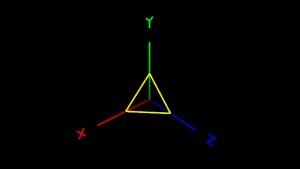

# 绘制坐标系



[查看示例](../../../../feng3dDemo/TestSegment.html)

 feng3d中添加绘制线段功能。

相关代码：

Segment.as 单条线段数据

SegmentSet.as 绘制线段类

Trident.as 坐标系

TestSegment.as 线段测试类

```javascript
package

{

import flash.display.StageAlign;

import flash.display.StageScaleMode;

import flash.events.Event;

import flash.geom.Vector3D;

import feng3d.containers.View3D;

import feng3d.debug.Trident;

import feng3d.entities.SegmentSet;

import feng3d.primitives.data.Segment;

/**

* 测试线段

* @author warden_feng 2014-4-9

*/

[SWF(width = “640”, height = “480”, frameRate = “60”, backgroundColor = “#FFFFFF”)]

public class TestSegment extends TestBase

{

public var _view:View3D;

public var trident:Trident;

public function TestSegment()

{

if (stage != null)

init();

else

addEventListener(Event.ADDED_TO_STAGE, init);

}

private function init(e:Event = null):void

{

if (hasEventListener(Event.ADDED_TO_STAGE))

removeEventListener(Event.ADDED_TO_STAGE, init);

stage.frameRate = 60;

stage.scaleMode = StageScaleMode.NO_SCALE;

stage.align = StageAlign.TOP_LEFT;

_view = new View3D();

addChild(_view);

//setup the camera

_view.camera.z = 200;

_view.camera.y = 200;

_view.camera.x = 200;

_view.camera.lookAt(new Vector3D());

//添加坐标系

trident = new Trident();

_view.scene.addChild(trident);

//添加3条线段

var segmentSet:SegmentSet = new SegmentSet();

trident.addChild(segmentSet);

var segmentX:Segment = new Segment(new Vector3D(0, 0, 50), new Vector3D(0, 50, 0), 0xffff00, 0xffff00, 1);

segmentSet.addSegment(segmentX);

var segmentY:Segment = new Segment(new Vector3D(0, 50, 0), new Vector3D(50, 0, 0), 0xffff00, 0xffff00, 1);

segmentSet.addSegment(segmentY);

var segmentZ:Segment = new Segment(new Vector3D(50, 0, 0), new Vector3D(0, 0, 50), 0xffff00, 0xffff00, 1);

segmentSet.addSegment(segmentZ);

addEventListener(Event.ENTER_FRAME, _onEnterFrame);

}

/**

* render loop

*/

private function _onEnterFrame(e:Event):void

{

trident.rotationY++;

_view.render();

}

}

}
```
