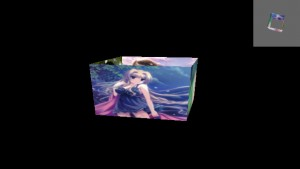

# 测试多个照相机



使用两个View3D,两个Camera3D，一个Scene3D创建两个视角。

[查看示例](../../../../feng3dDemo/TestMultiCamera.html)

```javascript
package

{

import flash.display.StageAlign;

import flash.display.StageScaleMode;

import flash.events.Event;

import flash.events.MouseEvent;

import flash.geom.Vector3D;

import feng3d.cameras.Camera3D;

import feng3d.containers.ObjectContainer3D;

import feng3d.containers.View3D;

import model3d.PhotoBox;

/**

* 测试多个照相机

* @author warden_feng 2014-3-27

*/

[SWF(width = “642”, height = “362”, frameRate = “60”, backgroundColor = “#FFFFFF”)]

public class TestMultiCamera extends TestBase

{

private var _view:View3D;

private var view1:View3D;

public var container3D:ObjectContainer3D;

public var camera1:Camera3D;

public var camera2:Camera3D;

public function TestMultiCamera()

{

if (stage != null)

init();

else

addEventListener(Event.ADDED_TO_STAGE, init);

}

private function init(e:Event = null):void

{

if (hasEventListener(Event.ADDED_TO_STAGE))

removeEventListener(Event.ADDED_TO_STAGE, init);

stage.scaleMode = StageScaleMode.NO_SCALE;

stage.align = StageAlign.TOP_LEFT;

_view = new View3D();

addChild(_view);

//setup the camera

_view.camera.z = -300;

_view.camera.y = 100;

_view.camera.lookAt(new Vector3D());

camera1 = _view.camera;

camera2 = new Camera3D();

camera2.y = 300;

camera2.z = 100;

camera2.lookAt(new Vector3D());

view1 = new View3D(_view.scene,camera2);

addChild(view1);

view1.width = view1.height = 100;

view1.x = stage.stageWidth – view1.width;

view1.backgroundColor = 0x666666;

container3D = new PhotoBox();

_view.scene.addChild(container3D);

addEventListener(Event.ENTER_FRAME, onEnterFrame);

stage.addEventListener(MouseEvent.MOUSE_WHEEL, onMouseWheel);

}

protected function onMouseWheel(event:MouseEvent):void

{

_view.camera.z += event.delta;

}

protected function onEnterFrame(event:Event):void

{

container3D.rotationY++;

}

}

}
```