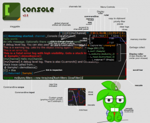
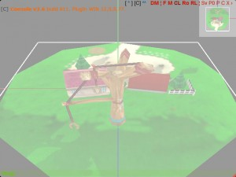
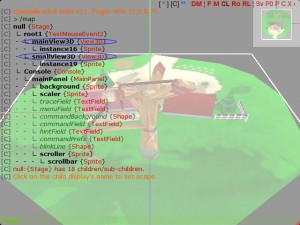
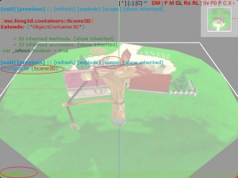
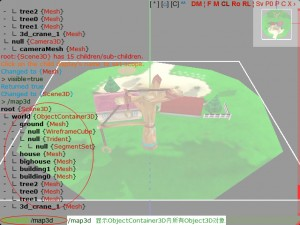
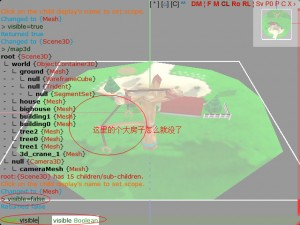

# flash控制台flash-console

flash-console是个极好的工具，是我的同事赵美女推荐给我的，得到这么好的神器，真是太感谢她了！当然最值得感激的还是这工具的作者Lu Aye Oo，太谢谢你了，让我能够使用如此好的工具！

记得当初得到这个工具的时候，整整让我兴奋了一周，因为这真是我一直想要的工具！这一周时间里面我看了一遍工具的源码，研究了了下执行代码的原理（很像大学教程里的《汇编原理》），同时也发现了点flash-console的一点小bug，计算的加减乘除优先级有问题，但这种小问题在强大的功能面前是可以完全忽略的啦！这工具在我之后的工作中帮助特别大，把很多麻烦的事情一下子变得简单了，比如可以一下子从界面的按钮定位这个按钮所在的文件，然后直接修改这个按钮的鼠标事件来着。

## flash-console获得方式

[github](https://github.com/junkbyte/flash-console)

## 示例

flash-console在我的实例中的操作方式（以[测试完整的鼠标事件](../../../../feng3dDemo/TestMouseEvent2.html) 为例）

1. 我在很多实例中开启了flash后台调试工具，使用主键盘中左上的按键~呼出控制台（按~键时要保证flash player能够接受鼠标事件，弹出控制台如图1所示）。

    

1. 在下面命令栏中使用基本命令“/map”遍历场景Stage（输入“/map”参考图4，enter键执行命令），显示结果如图2所示。

    

1. 鼠标点击mainView3D {View3D}中的View3D进入到View3D的结构，找到scene属性assign scene:me.feng3d.containers::Scene3D = {Scene3D}，点击Scene3D进入到Scene3D结构，最后点击“[exit] [previous] || [refresh] [explode] [scope] [show inherited]”这栏中的 [scope] 使命令行处于主场景Scene3D的范围内，此时最下面命令行左边显示Scene3D。结果如图3所示。

    

1. 在命令行中使用我扩展的命令“/map3d”遍历Scene3D中所有Object3D对象，遍历结果如图4所示

    

1. 随便找个想控制的场景实体，以bighouse为例（点击“bighouse {Mesh}”中的bighouse，命令行转换到Mesh空间，因为bighouse是Mesh对象，然后在命令行中输入visible=false回车后大房子消失了，输入visible=true回车后大房子便会显示），效果如图5所示。

    

1. 在下面命令中可以执行当前对象的方法与给当前对象的属性进行赋值等操作，flash-console还有很多其他的功能，希望朋友们可以去 [flash-console](https://github.com/junkbyte/flash-console) 学习。