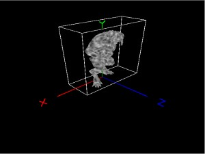

# 解析md5anim动作文件



[查看示例](../../../../feng3dDemo/MD5AnimMeshParserTest.html)

以下代码基本上都是away3d的MD5Anim解析代码，我只是按自己的理解添加或者翻译了注释。

```
package me.feng3d.parsers
{
	import flash.geom.Vector3D;
	
	import me.feng3d.arcane;
	import me.feng3d.animators.data.JointPose;
	import me.feng3d.animators.data.SkeletonPose;
	import me.feng3d.animators.nodes.SkeletonClipNode;
	import me.feng3d.core.math.Quaternion;
 
	use namespace arcane;
 
	/**
	 * 该类提供md5anim类型数据的解析，提供一个MD5类型的动画序列
	 */
	public class MD5AnimParser extends ParserBase
	{
		/** 文本数据 */
		private var _textData:String;
		/** 是否正在解析中 */
		private var _startedParsing:Boolean;
 
		//md5anim文件关键字
		private static const VERSION_TOKEN:String = "MD5Version";
		private static const COMMAND_LINE_TOKEN:String = "commandline";
		private static const NUM_FRAMES_TOKEN:String = "numFrames";
		private static const NUM_JOINTS_TOKEN:String = "numJoints";
		private static const FRAME_RATE_TOKEN:String = "frameRate";
		private static const NUM_ANIMATED_COMPONENTS_TOKEN:String = "numAnimatedComponents";
 
		private static const HIERARCHY_TOKEN:String = "hierarchy";
		private static const BOUNDS_TOKEN:String = "bounds";
		private static const BASE_FRAME_TOKEN:String = "baseframe";
		private static const FRAME_TOKEN:String = "frame";
 
		private static const COMMENT_TOKEN:String = "//";
 
		/** 当前解析位置 */
		private var _parseIndex:int;
		/** 是否文件尾 */
		private var _reachedEOF:Boolean;
		/** 当前解析行号 */
		private var _line:int;
		/** 当前行的字符位置 */
		private var _charLineIndex:int;
		/** 版本号 */
		private var _version:int;
		/** 帧率 */
		private var _frameRate:int;
		/** 总帧数 */
		private var _numFrames:int;
		/** 关节个数 */
		private var _numJoints:int;
		private var _numAnimatedComponents:int;
 
		/** 层级关系 */
		private var _hierarchy:Vector.<HierarchyData>;
		/** 包围盒数据 */
		private var _bounds:Vector.<BoundsData>;//貌似解析完毕后就没有使用过该数据
		/** 帧数据 */
		private var _frameData:Vector.<FrameData>;
		/** 基础帧数据 */
		private var _baseFrameData:Vector.<BaseFrameData>;
 
		/** 旋转四元素 */
		private var _rotationQuat:Quaternion;
		private var _clip:SkeletonClipNode;
 
		/**
		 * 创建一个MD5动画解析类
		 * @param additionalRotationAxis 附加旋转轴
		 * @param additionalRotationRadians 附加旋转角度
		 */
		public function MD5AnimParser(additionalRotationAxis:Vector3D = null, additionalRotationRadians:Number = 0)
		{
			super(ParserDataFormat.PLAIN_TEXT);
 
			//初始化旋转四元素
			_rotationQuat = new Quaternion();
			var t1:Quaternion = new Quaternion();
			var t2:Quaternion = new Quaternion();
 
			t1.fromAxisAngle(Vector3D.X_AXIS, -Math.PI * .5);
			t2.fromAxisAngle(Vector3D.Y_AXIS, -Math.PI * .5);
 
			_rotationQuat.multiply(t2, t1);
 
			if (additionalRotationAxis)
			{
				_rotationQuat.multiply(t2, t1);
				t1.fromAxisAngle(additionalRotationAxis, additionalRotationRadians);
				_rotationQuat.multiply(t1, _rotationQuat);
			}
		}
 
		/**
		 * 判断是否支持解析
		 * @param extension 文件类型
		 * @return
		 */
		public static function supportsType(extension:String):Boolean
		{
			extension = extension.toLowerCase();
			return extension == "md5anim";
		}
 
		/**
		 * 判断是否支持该数据的解析
		 * @param data 需要解析的数据
		 * @return
		 */
		public static function supportsData(data:*):Boolean
		{
			data = data;
			return false;
		}
 
		protected override function proceedParsing():Boolean
		{
			var token:String;
 
			if (!_startedParsing)
			{
				_textData = getTextData();
				_startedParsing = true;
			}
 
			while (hasTime())
			{
				token = getNextToken();
				switch (token)
				{
					case COMMENT_TOKEN:
						ignoreLine();
						break;
					case "":
						// can occur at the end of a file
						break;
					case VERSION_TOKEN:
						_version = getNextInt();
						if (_version != 10)
							throw new Error("Unknown version number encountered!");
						break;
					case COMMAND_LINE_TOKEN:
						parseCMD();
						break;
					case NUM_FRAMES_TOKEN:
						_numFrames = getNextInt();
						_bounds = new Vector.<BoundsData>();
						_frameData = new Vector.<FrameData>();
						break;
					case NUM_JOINTS_TOKEN:
						_numJoints = getNextInt();
						_hierarchy = new Vector.<HierarchyData>(_numJoints, true);
						_baseFrameData = new Vector.<BaseFrameData>(_numJoints, true);
						break;
					case FRAME_RATE_TOKEN:
						_frameRate = getNextInt();
						break;
					case NUM_ANIMATED_COMPONENTS_TOKEN:
						_numAnimatedComponents = getNextInt();
						break;
					case HIERARCHY_TOKEN:
						parseHierarchy();
						break;
					case BOUNDS_TOKEN:
						parseBounds();
						break;
					case BASE_FRAME_TOKEN:
						parseBaseFrame();
						break;
					case FRAME_TOKEN:
						parseFrame();
						break;
					default:
						if (!_reachedEOF)
							sendUnknownKeywordError();
				}
 
				//解析出 骨骼动画数据
				if (_reachedEOF)
				{
					_clip = new SkeletonClipNode();
					translateClip();
					finalizeAsset(_clip);
					return ParserBase.PARSING_DONE;
				}
			}
			return ParserBase.MORE_TO_PARSE;
		}
 
		/**
		 * 收集所有的关键帧数据
		 */
		private function translateClip():void
		{
			for (var i:int = 0; i < _numFrames; ++i)
				_clip.addFrame(translatePose(_frameData[i]), 1000 / _frameRate);
		}
 
		/**
		 * 将一个关键帧数据转换为SkeletonPose
		 * @param frameData 帧数据
		 * @return 包含帧数据的SkeletonPose对象
		 */
		private function translatePose(frameData:FrameData):SkeletonPose
		{
			var hierarchy:HierarchyData;
			var pose:JointPose;
			var base:BaseFrameData;
			var flags:int;
			var j:int;
			//偏移量
			var translate:Vector3D = new Vector3D();
			//旋转四元素
			var orientation:Quaternion = new Quaternion();
			var components:Vector.<Number> = frameData.components;
			//骨骼pose数据
			var skelPose:SkeletonPose = new SkeletonPose();
			//骨骼pose列表
			var jointPoses:Vector.<JointPose> = skelPose.jointPoses;
 
			for (var i:int = 0; i < _numJoints; ++i)
			{
				//通过原始帧数据与层级数据计算出当前骨骼pose数据
				j = 0;
				//层级数据
				hierarchy = _hierarchy[i];
				//基础帧数据
				base = _baseFrameData[i];
				//层级标记
				flags = hierarchy.flags;
				translate.x = base.position.x;
				translate.y = base.position.y;
				translate.z = base.position.z;
				orientation.x = base.orientation.x;
				orientation.y = base.orientation.y;
				orientation.z = base.orientation.z;
 
				//调整位移与角度数据
				if (flags & 1)
					translate.x = components[hierarchy.startIndex + (j++)];
				if (flags & 2)
					translate.y = components[hierarchy.startIndex + (j++)];
				if (flags & 4)
					translate.z = components[hierarchy.startIndex + (j++)];
				if (flags & 8)
					orientation.x = components[hierarchy.startIndex + (j++)];
				if (flags & 16)
					orientation.y = components[hierarchy.startIndex + (j++)];
				if (flags & 32)
					orientation.z = components[hierarchy.startIndex + (j++)];
 
				//计算四元素w值
				var w:Number = 1 - orientation.x * orientation.x - orientation.y * orientation.y - orientation.z * orientation.z;
				orientation.w = w < 0 ? 0 : -Math.sqrt(w);
 
				//创建关节pose数据
				pose = new JointPose();
				if (hierarchy.parentIndex < 0)
				{
					pose.orientation.multiply(_rotationQuat, orientation);
					pose.translation = _rotationQuat.rotatePoint(translate);
				}
				else
				{
					pose.orientation.copyFrom(orientation);
					pose.translation.x = translate.x;
					pose.translation.y = translate.y;
					pose.translation.z = translate.z;
				}
				pose.orientation.y = -pose.orientation.y;
				pose.orientation.z = -pose.orientation.z;
				pose.translation.x = -pose.translation.x;
 
				jointPoses[i] = pose;
			}
 
			return skelPose;
		}
 
		/**
		 * 解析骨骼的层级数据
		 */
		private function parseHierarchy():void
		{
			var ch:String;
			var data:HierarchyData;
			var token:String = getNextToken();
			var i:int = 0;
 
			if (token != "{")
				sendUnknownKeywordError();
 
			do
			{
				if (_reachedEOF)
					sendEOFError();
				data = new HierarchyData();
				data.name = parseLiteralString();
				data.parentIndex = getNextInt();
				data.flags = getNextInt();
				data.startIndex = getNextInt();
				_hierarchy[i++] = data;
 
				ch = getNextChar();
 
				if (ch == "/")
				{
					putBack();
					ch = getNextToken();
					if (ch == COMMENT_TOKEN)
						ignoreLine();
					ch = getNextChar();
				}
 
				if (ch != "}")
					putBack();
 
			} while (ch != "}");
		}
 
		/**
		 * 解析帧边界
		 */
		private function parseBounds():void
		{
			var ch:String;
			var data:BoundsData;
			var token:String = getNextToken();
			var i:int = 0;
 
			if (token != "{")
				sendUnknownKeywordError();
 
			do
			{
				if (_reachedEOF)
					sendEOFError();
				data = new BoundsData();
				data.min = parseVector3D();
				data.max = parseVector3D();
				_bounds[i++] = data;
 
				ch = getNextChar();
 
				if (ch == "/")
				{
					putBack();
					ch = getNextToken();
					if (ch == COMMENT_TOKEN)
						ignoreLine();
					ch = getNextChar();
				}
 
				if (ch != "}")
					putBack();
 
			} while (ch != "}");
		}
 
		/**
		 * 解析基础帧
		 */
		private function parseBaseFrame():void
		{
			var ch:String;
			var data:BaseFrameData;
			var token:String = getNextToken();
			var i:int = 0;
 
			if (token != "{")
				sendUnknownKeywordError();
 
			do
			{
				if (_reachedEOF)
					sendEOFError();
				data = new BaseFrameData();
				data.position = parseVector3D();
				data.orientation = parseQuaternion();
				_baseFrameData[i++] = data;
 
				ch = getNextChar();
 
				if (ch == "/")
				{
					putBack();
					ch = getNextToken();
					if (ch == COMMENT_TOKEN)
						ignoreLine();
					ch = getNextChar();
				}
 
				if (ch != "}")
					putBack();
 
			} while (ch != "}");
		}
 
		/**
		 * 解析帧
		 */
		private function parseFrame():void
		{
			var ch:String;
			var data:FrameData;
			var token:String;
			var frameIndex:int;
 
			frameIndex = getNextInt();
 
			token = getNextToken();
			if (token != "{")
				sendUnknownKeywordError();
 
			do
			{
				if (_reachedEOF)
					sendEOFError();
				data = new FrameData();
				data.components = new Vector.<Number>(_numAnimatedComponents, true);
 
				for (var i:int = 0; i < _numAnimatedComponents; ++i)
					data.components[i] = getNextNumber();
 
				_frameData[frameIndex] = data;
 
				ch = getNextChar();
 
				if (ch == "/")
				{
					putBack();
					ch = getNextToken();
					if (ch == COMMENT_TOKEN)
						ignoreLine();
					ch = getNextChar();
				}
 
				if (ch != "}")
					putBack();
 
			} while (ch != "}");
		}
 
		/**
		 * 返回到上个字符位置
		 */
		private function putBack():void
		{
			_parseIndex--;
			_charLineIndex--;
			_reachedEOF = _parseIndex >= _textData.length;
		}
 
		/**
		 * 获取下个关键字
		 */
		private function getNextToken():String
		{
			var ch:String;
			var token:String = "";
 
			while (!_reachedEOF)
			{
				ch = getNextChar();
				if (ch == " " || ch == "\r" || ch == "\n" || ch == "\t")
				{
					if (token != COMMENT_TOKEN)
						skipWhiteSpace();
					if (token != "")
						return token;
				}
				else
					token += ch;
 
				if (token == COMMENT_TOKEN)
					return token;
			}
 
			return token;
		}
 
		/**
		 * 跳过空白
		 */
		private function skipWhiteSpace():void
		{
			var ch:String;
 
			do
				ch = getNextChar();
			while (ch == "\n" || ch == " " || ch == "\r" || ch == "\t");
 
			putBack();
		}
 
		/**
		 * 忽略该行
		 */
		private function ignoreLine():void
		{
			var ch:String;
			while (!_reachedEOF && ch != "\n")
				ch = getNextChar();
		}
 
		/**
		 * 读取下个字符
		 */
		private function getNextChar():String
		{
			var ch:String = _textData.charAt(_parseIndex++);
 
			if (ch == "\n")
			{
				++_line;
				_charLineIndex = 0;
			}
			else if (ch != "\r")
				++_charLineIndex;
 
			if (_parseIndex == _textData.length)
				_reachedEOF = true;
 
			return ch;
		}
 
		/**
		 * 读取下个int
		 */
		private function getNextInt():int
		{
			var i:Number = parseInt(getNextToken());
			if (isNaN(i))
				sendParseError("int type");
			return i;
		}
 
		/**
		 * 读取下个Number
		 */
		private function getNextNumber():Number
		{
			var f:Number = parseFloat(getNextToken());
			if (isNaN(f))
				sendParseError("float type");
			return f;
		}
 
		/**
		 * 解析3d向量
		 */
		private function parseVector3D():Vector3D
		{
			var vec:Vector3D = new Vector3D();
			var ch:String = getNextToken();
 
			if (ch != "(")
				sendParseError("(");
			vec.x = getNextNumber();
			vec.y = getNextNumber();
			vec.z = getNextNumber();
 
			if (getNextToken() != ")")
				sendParseError(")");
 
			return vec;
		}
 
		/**
		 * 解析四元素
		 */
		private function parseQuaternion():Quaternion
		{
			var quat:Quaternion = new Quaternion();
			var ch:String = getNextToken();
 
			if (ch != "(")
				sendParseError("(");
			quat.x = getNextNumber();
			quat.y = getNextNumber();
			quat.z = getNextNumber();
 
			// quat supposed to be unit length
			var t:Number = 1 - (quat.x * quat.x) - (quat.y * quat.y) - (quat.z * quat.z);
			quat.w = t < 0 ? 0 : -Math.sqrt(t);
 
			if (getNextToken() != ")")
				sendParseError(")");
 
			return quat;
		}
 
		/**
		 * 解析命令行数据
		 */
		private function parseCMD():void
		{
			// just ignore the command line property
			parseLiteralString();
		}
 
		/**
		 * 解析带双引号的字符串
		 */
		private function parseLiteralString():String
		{
			skipWhiteSpace();
 
			var ch:String = getNextChar();
			var str:String = "";
 
			if (ch != "\"")
				sendParseError("\"");
 
			do
			{
				if (_reachedEOF)
					sendEOFError();
				ch = getNextChar();
				if (ch != "\"")
					str += ch;
			} while (ch != "\"");
 
			return str;
		}
 
		/**
		 * 抛出一个文件尾过早结束文件时遇到错误
		 */
		private function sendEOFError():void
		{
			throw new Error("Unexpected end of file");
		}
 
		/**
		 * 遇到了一个意想不到的令牌时将抛出一个错误。
		 * @param expected 发生错误的标记
		 */
		private function sendParseError(expected:String):void
		{
			throw new Error("Unexpected token at line " + (_line + 1) + ", character " + _charLineIndex + ". " + expected + " expected, but " + _textData.charAt(_parseIndex - 1) + " encountered");
		}
 
		/**
		 * 发生未知关键字错误
		 */
		private function sendUnknownKeywordError():void
		{
			throw new Error("Unknown keyword at line " + (_line + 1) + ", character " + _charLineIndex + ". ");
		}
	}
}
 
import flash.geom.Vector3D;
 
import me.feng3d.core.math.Quaternion;
 
/**
 * 层级数据
 */
class HierarchyData
{
	/** Joint 名字 */
	public var name:String;
	/** 父节点序号 */
	public var parentIndex:int;
	/** flag */
	public var flags:int;
	/** 影响的帧数据起始索引 */
	public var startIndex:int;
 
	public function HierarchyData()
	{
	}
}
 
/**
 * 包围盒信息
 */
class BoundsData
{
	/** 最小坐标 */
	public var min:Vector3D;
	/** 最大坐标 */
	public var max:Vector3D;
 
	public function BoundsData()
	{
	}
}
 
/**
 * 基础帧数据
 */
class BaseFrameData
{
	/** 位置 */
	public var position:Vector3D;
	/** 旋转四元素 */
	public var orientation:Quaternion;
 
	public function BaseFrameData()
	{
	}
}
 
/**
 * 帧数据
 */
class FrameData
{
	public var index:int;
	public var components:Vector.<Number>;
 
	public function FrameData()
	{
	}
}
```

这里个as代码主要功能是解析出一个动作类SkeletonClipNode，但translatePose函数却是最关键的代码，因为它处理的是骨骼的姿态，顶点的坐标最终就是有骨骼姿态计算得出！

渲染骨骼动画过程：

1、由动画时间计算当前帧与下一帧还有所占混合权重———————————–AnimationClipState.updateFrames()

2、由当前帧、下一帧与从动作文件中解析出的动作数据获取两帧骨骼pose—————————-SkeletonClipState.updateFrames()

3、由两帧骨骼pose计算每个关节pose（关节的旋转与平移）得到当前骨骼pose————————————-SkeletonClipState.updateSkeletonPose()

4、由当前骨骼pose计算每个关节的全局pose————————————–SkeletonAnimator.localToGlobalPose(）

5、有全局骨骼pose转换为骨骼全局转换矩阵（每个关节的全局转换矩阵）—————————————-SkeletonAnimator.updateGlobalProperties()

6、选着蒙皮方式，选着使用gpu还是cpu蒙皮（这里选着使用cpu运算，该部分的gpu蒙皮过程后面文章将会讲解）——————SkeletonAnimator.setRenderState（）

7、使用MD5MeshParser解析出来的SkinnedSubGeometry数据里的关节索引数据、关节权重数据（每个顶点都有对应数据），再结合5中计算出的骨骼全局转换矩阵进行蒙皮（计算每个顶点坐标、切线、法线数据）—————————–SkeletonAnimator.morphGeometry

8、上传顶点数据渲染动画（后面的渲染就和mesh一样了）

 

从1到5的过程就是计算在当前时间每个关节的全局旋转（四元素表示）、位移。

第3步这个地方计算关节旋转使用的是四元素插值（slerp），这个插值过程不能够放在计算出关节的全局转换矩阵后采用插值（矩阵不支持插值操作）。

因为矩阵不支持插值操作，所以我们不能把关节关键帧的全局转换矩阵保存下来，也就不得不每次计算一遍。

 

第4步执行的是关节连接操作来计算全局pose，旋转角度连接（四元素连接）与位移连接（这里并不是普通的向量相加，需要考虑父关节的旋转来的的位移）。