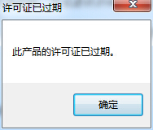

# 处理flash builder4.7sdk升级bug

昨天为了升级sdk来运行AGAL2.0的demo，一切配置都没问题，但是运行时报错

VerifyError：Error #1014：无法找到类 flash.display3D.textures::RectangleTexture。

更换sdk也没有解决，但是在拷贝文件时出现了两个文件无法复制（由于文件名过长，我无法解决这个无法复制的问题，也许就是这个问题引发的报错吧）。

最后我觉得还是Flash builder4.7破解引发的问题，决定使用其他的破解方法，最近解决了报错的这个问题。

破解方式如下：

原文地址： [[ActionScript 3] Flash Builder 4.7 完美破解(非替换文件式，很安全)](http://bbs.9ria.com/thread-277060-1-1.html)

1. 准备安装文件和序列号生成器
1Adobe Flash Builder 4.7 的安装文件可以从以下两个连接下载到；

•32bit：
    http://trials3.adobe.com/AdobeProducts/FLBR/4_7/win32/FlashBuilder_4_7_LS10.exe
    
•64bit：
    http://trials3.adobe.com/AdobeProducts/FLBR/4_7/win64/FlashBuilder_4_7_LS10_win64.exe
    
下载之前，先用你的Adobe ID 从Adobe的网站上登录一下，否则下载不成功。
xf-mccs6.exe 是序列号生成器，可以从这个地址下载到：http://url.cn/K1tDGu。

2. 断开网络，至于怎么断法，这个不用我多说了吧。

3. 检查一下你的Host文件，看看里面有没有与Adobe相关的设置，如果有，清除掉。

4. 清理工作完成后，打开序列号生成器，生成一个序列号，把序列号的前4位替换为“1424”，并保持打开状态，不要关闭它，后面还要用到，如下图所示：

5. 安装Flash Builder 4.7 ，选择使用序列号安装

6. 把刚才生成的序列号复制到安装序列号框里

7. 下一步后会出现网络不可用的提示框（这就对了，就是为了不让它联网验证），点“稍候连接”。

8. 选择安装路径进行安装，这个没什么可说的

9. 漫长的等待安装，无聊………….

10. 安装完成，关闭窗口

11. 启动Flash Builder 4.7 这时候会连接网络去验证序列号，由于刚才安装之前就已经断网了，所以会出现无法连接网络的界面，这时候，点那个“连接Internet时是否出现问题？”的连接。

12. 选择“脱机激活”再点击“生成请求码”

13. 把生成的请求码复制到序列号生成器的第二个框里，点击左边的生成按钮，生成最终的响应代码。

14. 把生成的响应代码复制到Flash Builder的响应代码框中，点“激活”。

15.为了防止日后我们在使用的时候，Flash Builder 4.7 自动联网验证，导致激活失效，还是要把下面这几行东西加到Host里的。

    127.0.0.1   activate.adobe.com
    127.0.0.1   practivate.adobe.com
    127.0.0.1   lmlicenses.wip4.adobe.com
    127.0.0.1   lm.licenses.adobe.com

17. 好了，大功告成，打开Flash Builder 4.7，看一下我们的成果吧。现在你可以恢复你的网络了。
 
注意事项：如果在安装过程中遇到什么问题，请检查是否有 C:\Program Files (x86)\Common Files\Adobe\SLCache，C:\ProgramData\Adobe\SLStore 这两个目录，如果有的话就将它们清空，然后从第1步开始重新安装。
 
我的安装过程中还遇到了点其他的问题：

1. 许可证已过期，解决方式是把系统时间调整到2012年，该提示便不会出现了。

2. 按照上面破解方式做到第11步时没有出现“连接Internet时是否出现问题？”或者被上面的界面给盖着了点不了。

解决方式是重新再启动flash builder4.7，然后就会出现了，可以继续进行下去了。