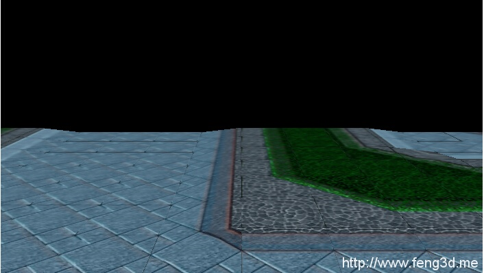

# 解析魔兽争霸地形

[查看示例](../../../../feng3dDemo/War3TerrainTest.html)

该实例是使用feng3d的一个应用，实现了war3地形，在八月初已经制作出，但由于性能问题一直没有发布该实例，该问题目前还未解决。

运行时需要加载资源，会黑屏一段时间，请耐心等待。

参考资料：

[【转】[翻译版]inside w3m(完结)](blogs/2014/07/20/2.md)

[【转】War3.mpq中slk文件详解](blogs/2014/07/20/1.md)

[解析魔兽模型](blogs/2014/07/05/1.md)