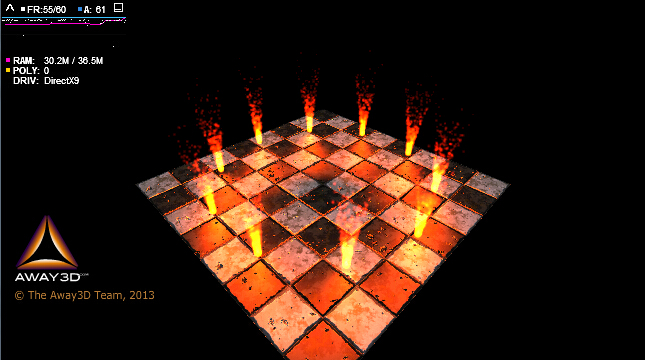

# feng3d引擎更新20150722

[查看示例](../../../../feng3dDemo/Basic_Fire.html)  ([示例代码](http://git.oschina.net/wardenfeng/feng3d/blob/shadowmap/feng3d_away3dExamples/src/Basic_Fire.as?dir=0&filepath=feng3d_away3dExamples%2Fsrc%2FBasic_Fire.as&oid=b272554628a75341ff37fd163e))

## 发布最新feng3d源码

feng3d引擎代码全部更新至[Git@OSC](http://git.oschina.net/)

[http://git.oschina.net/wardenfeng/feng3d](http://git.oschina.net/wardenfeng/feng3d)

[shadowmap](http://git.oschina.net/wardenfeng/feng3d/tree/shadowmap/)为最新稳定分支

这里将会保持最新的代码！

## 发布feng3d的svn服务器文件

[feng3d的svn仓库文件](http://pan.baidu.com/s/1c02iavI)

该文件可以获取到feng3d从2014年3月14日至2015年07月22日的所有版本。

使用方法：用VisualSVN-Server-2.7.2导入该文件后便可用svn客户端导出你所想查看的任意版本。

这个文件可以让你们看到feng3d实现的全过程，如果你是新手的话也许将会更有用处！