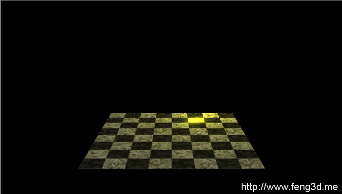
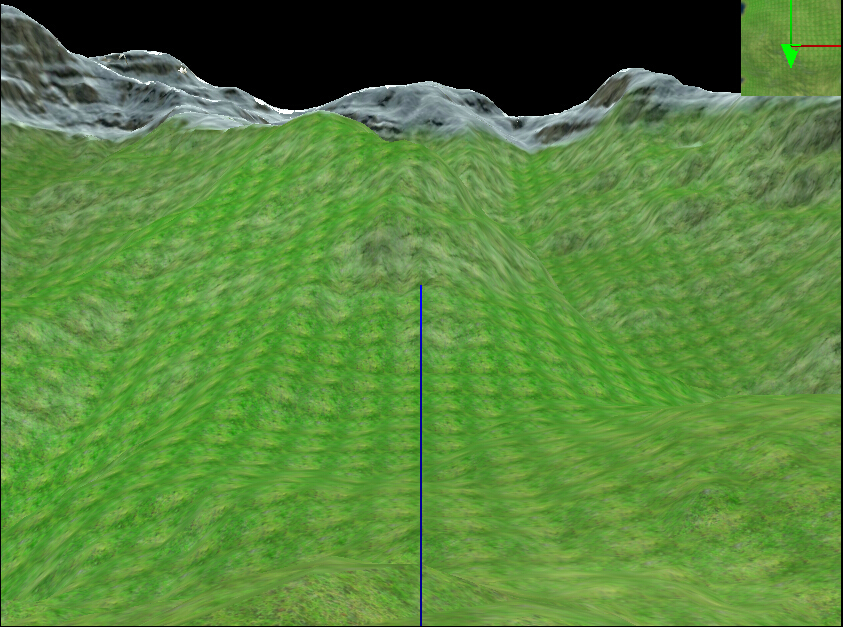

# feng3d demo

## 粒子特效

## Fagal首个实例BaseShaderTest

## 魔兽争霸地形

## 法线贴图

## 点光源

## 方向光照

## 高度地形]

## gpu渲染md5动画 渲染程序详解

## 解析md5anim动作文件

## 解析MD5MESH模型文件

## 解析魔兽模型

## 测试完整的鼠标事件

## 物体边界

## 场景建设 模型设计

## 多个角度观察物体

## 绘制坐标系

## Obj解析

## 照相机
